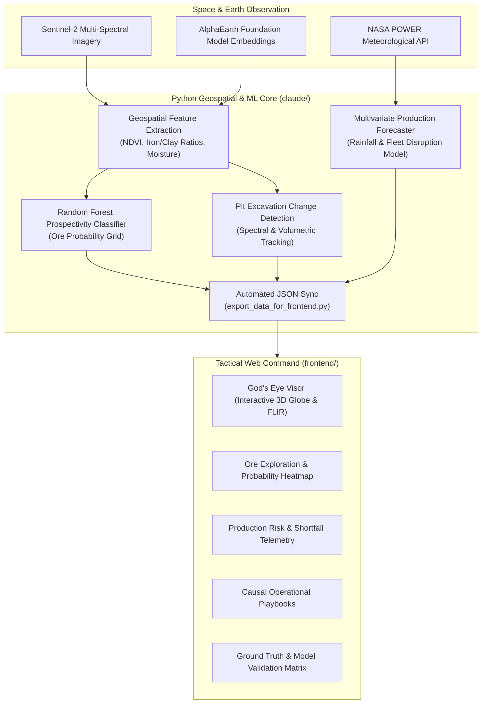

# ADHARA: Multimodal Satellite Remote Sensing & Production Optimization Platform

[](https://www.sih.gov.in/)
[](#)
[](https://vitejs.dev/)
[](https://www.python.org/)
[](LICENSE)

> **ADHARA** is an end-to-end space-tech and causal AI platform developed for **MOIL Limited (Ministry of Steel)** under **Smart India Hackathon (SIH Problem Statement SIH26009)**. It integrates multi-spectral satellite remote sensing, pit excavation tracking, AI ore prospectivity mapping, and predictive shortfall analytics to optimize manganese extraction and strategic resource management.

---

## Architecture Overview



---

## Core Capabilities

1. **God's Eye Visor (3D Orbital Reconnaissance)**
   - Interactive Three.js 3D earth globe geolocated to MOIL's active concession zones (Balaghat, Dongri Buzurg, Gumgaon, Chikla, Kandri, Tirodi).
   - Tactical FLIR thermal overlay, multispectral vegetation/mineral reflectance filters, and orbital telemetry HUD.

2. **Ore Prospectivity Mapping**
   - High-resolution spatial grid scoring ore probability from multi-spectral band indices and geological proxies.
   - Dynamic threshold slicing, high-confidence target identification, and coordinates exporter for field drill targeting.

3. **Pit Change Detection & Monitoring**
   - Temporal comparison of open-pit boundaries, overburden dumps, and excavation volume progression over multi-month observation windows.

4. **Weather-Aware Production Forecasting**
   - Ingests precipitation telemetry (e.g. NASA POWER district historical data) alongside haulage efficiency and plant downtime to predict 90-day output and shortfall risks.

5. **Causal Dispatch & Intervention Playbooks**
   - Prescriptive recommendations for pit drainage, fleet rerouting, and grade blending when shortfall alerts fire.

6. **Ground Truth Validation Matrix**
   - Full precision, recall, ROC-AUC metrics, and confusion matrices validating satellite predictions against historical borehole and production records.

---

## Project Structure

```
.
├── claude/                         # Python Geospatial & ML Core
│   ├── app.py                      # Streamlit ML Intelligence Cockpit
│   ├── compute_pit_change_detection.py # Pit boundary & excavation analysis
│   ├── data_generator.py           # Geospatial & production dataset generator
│   ├── export_data_for_frontend.py # Automated JSON telemetry exporter
│   ├── fetch_alphaearth_embeddings.py # Satellite embedding pipeline
│   ├── fetch_real_rainfall.py      # NASA POWER rainfall telemetry fetcher
│   ├── train_prospectivity.py      # AlphaEarth + RF Ore Prospectivity model
│   ├── train_forecast.py           # Production shortfall forecast model
│   └── requirements.txt            # Python dependencies
│
├── frontend/                       # Tactical Web Platform
│   ├── src/
│   │   ├── components/
│   │   │   ├── layout/             # HeaderBar, KpiRibbon
│   │   │   ├── tabs/               # Exploration, Forecast, Playbook, Validation
│   │   │   ├── ui/                 # Accessible UI components
│   │   │   └── visor/              # 3D Globe, FLIR & Satellite Stages
│   │   ├── data/                   # Synced GeoJSON and telemetry feeds
│   │   └── App.jsx                 # Master application controller
│   ├── package.json
│   └── vite.config.js
│
├── .agents/skills/                 # AI Assistant Specialized Skills
├── run.bat                         # Master Windows launcher CLI
├── start.bat                       # Quick-launch entry point
└── README.md
```

---

## Quickstart Guide

### Prerequisites
- **Node.js**: v18.0 or higher
- **Python**: v3.9 or higher
- **Git**

### 1. Launch via Master Batch Launcher (Recommended on Windows)
Simply double-click or run:
```cmd
run.bat
```
This presents an interactive menu with one-click options:
- `[1]` Start Primary Web Platform (`http://localhost:3000`)
- `[2]` Start Streamlit ML Engine (`http://localhost:8501`)
- `[3]` Launch Full Stack (both servers simultaneously)
- `[4]` Retrain ML Models & Sync Data
- `[5]` Install All Dependencies

### 2. Manual Setup

#### Frontend (React + Vite)
```bash
cd frontend
npm install
npm run dev
```
Open `http://localhost:3000` in your browser.

#### Python ML Pipeline & Streamlit Dashboard
```bash
cd claude
pip install -r requirements.txt

# Run the AI pipeline:
python data_generator.py
python train_prospectivity.py
python train_forecast.py
python export_data_for_frontend.py

# Launch Streamlit:
streamlit run app.py
```

---

## Tech Stack

- **Frontend**: React 18, Vite 8, Tailwind CSS, Three.js, Lucide React, Leaflet
- **ML / Backend**: Python 3.9+, Scikit-Learn, Pandas, NumPy, Streamlit, Matplotlib
- **Earth Observation Data**: Sentinel-2 (Copernicus), NASA POWER Agroclimatology, AlphaEarth Foundation Embeddings

---

## SIH 2024 / 2026 Problem Statement Alignment
- **Problem Statement ID**: SIH26009
- **Organization**: MOIL Limited (Min. of Steel)
- **Domain**: Space Technology, Remote Sensing, Critical Mineral Exploration & Mine Operations Optimization

---

## License
This project is open-source under the MIT License.
