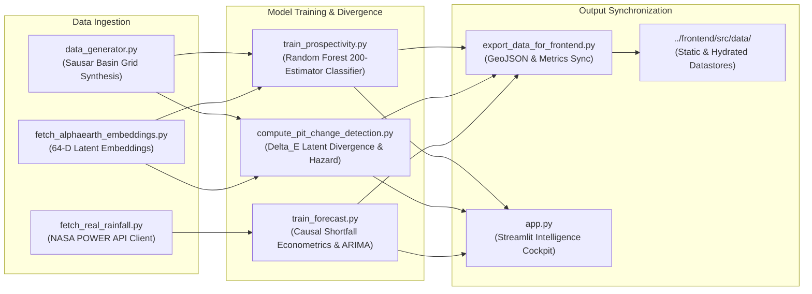

# ADHARA Analytical Core: Geospatial Machine Learning & Time-Series Engine
### Technical Pipeline Specification & Execution Protocols
**Subsystem:** `claude/` | **Context:** SIH26009 MOIL Remote Sensing & Optimization

---

## 1. Subsystem Architecture

The `claude/` directory encapsulates the quantitative and earth observation logic of the ADHARA platform. It operates both as an independent analytical engine (with a dedicated Streamlit intelligence dashboard) and as the authoritative data compiler that feeds telemetry to the React web cockpit.



---

## 2. Script Registry & Pipeline Components

| Script | Purpose & Methodology | Key Dependencies | Primary Artifacts |
|---|---|---|---|
| `fetch_real_rainfall.py` | Connects to NASA POWER Agroclimatology API, pulls monthly precipitation (`PRECTOTCORR`) for Balaghat ($21.8700^\circ\text{N}, 80.1800^\circ\text{E}$). | `requests`, `pandas`, `calendar` | `real_rainfall_balaghat.csv` |
| `fetch_alphaearth_embeddings.py` | Google Earth Engine client querying `GOOGLE/SATELLITE_EMBEDDING/V1_ANNUAL` (10m resolution, 64 latent channels). Includes resilient local fallback. | `numpy`, `pandas`, `ee` (optional) | Latent unit vector feature columns |
| `data_generator.py` | Synthesizes physical proxies (NDVI, soil moisture, land surface temperature) across a $30 \times 30$ grid (900 spatial cells) modeling the Sausar Belt. | `numpy`, `pandas` | `grid_data.csv` |
| `train_prospectivity.py` | Trains Random Forest classifier ($N=200, d=8$) fusing geobotanical stress with AlphaEarth cosine similarity. Computes ROC-AUC, PR-AUC, and feature importances. | `scikit-learn`, `joblib`, `matplotlib` | `grid_predictions.csv`, `prospectivity_model.pkl`, `prospectivity_heatmap.png` |
| `compute_pit_change_detection.py` | Evaluates annual latent distance $\Delta E = 1 - (\mathbf{v}_{2017} \cdot \mathbf{v}_{2024})$ and computes bench waterlogging hazard index ($W_{\text{risk}}$). | `pandas`, `numpy`, `matplotlib` | `pit_change_detection.csv`, `pit_change_detection.png` |
| `train_forecast.py` | Compares Holt-Winters Exponential Smoothing, ARIMA(1,1,1), and Multivariate Causal Regression for 90-day shortfall risk evaluation. | `statsmodels`, `scikit-learn`, `matplotlib` | `forecast_results.csv`, `forecast_model.pkl`, `forecast_chart.png` |
| `export_data_for_frontend.py` | Compiles models, grids, pit divergence, and production telemetry into typed JSON structures consumed by `frontend/src/data/`. | `os`, `json`, `pandas`, `joblib` | `gridData.json`, `forecastResults.json`, `modelMetrics.json`, `mines.json` |
| `app.py` | Comprehensive Streamlit dashboard providing interactive 2D GIS visualization, pit divergence heatmaps, and what-if simulation sliders. | `streamlit`, `pandas`, `numpy`, `matplotlib` | Web UI at `http://localhost:8501` |

---

## 3. Mathematical Specifications

### Ore Prospectivity Classifier
The model computes the conditional probability of manganese occurrence given surface observation vector $\mathbf{x} \in \mathbb{R}^k$:
$$P(\text{Ore} = 1 \mid \mathbf{x}) = \frac{1}{T} \sum_{t=1}^T h_t(\mathbf{x})$$
Where $T = 200$ decision trees, each grown to maximum depth $d = 8$ with Gini impurity splitting criterion:
$$I_G(p) = 1 - \sum_{i=0}^1 p_i^2$$

### Latent Temporal Divergence ($\Delta E$)
Given foundation unit-vectors $\mathbf{v}_{2017}, \mathbf{v}_{2024} \in \mathbb{R}^{64}$ with $\|\mathbf{v}\|_2 = 1.0$:
$$\Delta E = 1 - \langle \mathbf{v}_{2017}, \mathbf{v}_{2024} \rangle$$
Threshold partitioning:
$$\text{Class} = \begin{cases}
\text{Active Excavation / Bench Cut}, & \Delta E \ge 0.05 \\
\text{Overburden / Dump Movement}, & 0.02 \le \Delta E < 0.05 \\
\text{Stable Unmined Country Rock}, & \Delta E < 0.02
\end{cases}$$

### Causal Econometric Shortfall Model
$$Y_t = \hat{\beta}_0 + \hat{\beta}_1 \cdot t + \hat{\beta}_2 \cdot R_t + \hat{\beta}_3 \cdot D_t$$
Shortfall condition triggered when predicted tonnage falls below $90\%$ of 30-month rolling mean:
$$\mathbb{I}_{\text{risk}} = \mathbb{I}\left(Y_t < 0.90 \times \bar{Y}\right)$$

---

## 4. Execution Sequence

To regenerate all model weights, evaluation metrics, and synchronized frontend feeds from source:

```bash
# 1. Fetch precipitation telemetry
python fetch_real_rainfall.py

# 2. Generate calibrated Sausar Group spatial grid
python data_generator.py

# 3. Train prospectivity model & export probability grid
python train_prospectivity.py

# 4. Compute pit change detection & waterlogging hazards
python compute_pit_change_detection.py

# 5. Train shortfall forecaster & risk attribution
python train_forecast.py

# 6. Synchronize JSON data stores to frontend/src/data/
python export_data_for_frontend.py

# 7. (Optional) Run Streamlit ML Intelligence Engine
streamlit run app.py
```

---

## 5. Environment & Dependencies

Dependencies are strictly pinned in [requirements.txt](file:///c:/Users/Lenovo/Downloads/sih%20hackathon/claude/requirements.txt):
* `streamlit >= 1.28.0`
* `pandas >= 2.0.0`
* `numpy >= 1.24.0`
* `scikit-learn >= 1.3.0`
* `matplotlib >= 3.7.0`
* `statsmodels >= 0.14.0`
* `joblib >= 1.3.0`
* `requests >= 2.31.0`
